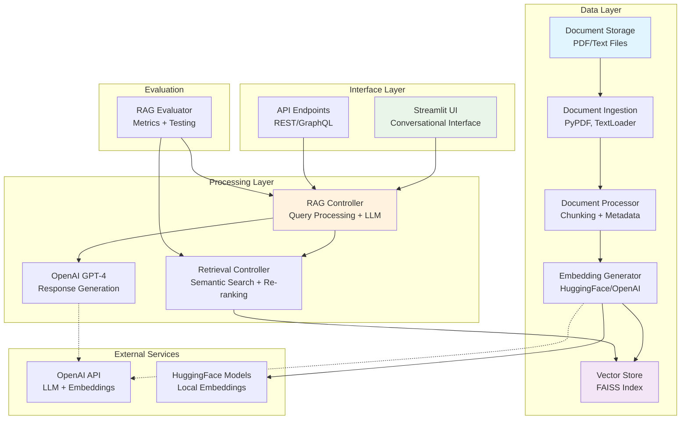

# RAG System Design & Architecture

## Design Decisions

### Scalability
- **Horizontal Scaling**: Replace FAISS with distributed vector databases (Pinecone, Weaviate) for multi-node deployment
- **Batch Processing**: Implement async document ingestion pipelines for large document volumes
- **Caching Strategy**: Redis-based embedding and response caching to reduce computational overhead
- **Load Balancing**: Microservice architecture with API gateways for concurrent user requests
- **Storage Optimization**: Separate hot/cold storage for frequently vs. rarely accessed documents

### Architectural Choices
- **Modular Pipeline**: Decoupled components enable independent scaling and technology swaps
- **Local-First Design**: FAISS and HuggingFace models reduce external API dependencies and costs
- **Metadata-Rich Indexing**: Enhanced document metadata enables sophisticated filtering and temporal queries
- **Hybrid Retrieval Ready**: Architecture supports future integration of keyword search alongside semantic search
- **Stateless Services**: Controllers designed for horizontal scaling without session persistence

### Deployment
- **Containerization**: Docker containers for each service (ingestion, retrieval, UI) with orchestration via Docker Compose
- **Cloud Deployment**: 
  - **AWS**: ECS/EKS with S3 document storage, RDS for metadata, ElastiCache for caching
  - **GCP**: Cloud Run with Cloud Storage, Cloud SQL, Memorystore
  - **Azure**: Container Instances with Blob Storage, Azure Database, Redis Cache
- **CI/CD Pipeline**: GitHub Actions for automated testing, building, and deployment
- **Monitoring**: Prometheus/Grafana for metrics, centralized logging with ELK stack
- **API Gateway**: Rate limiting, authentication, and request routing for production use

## Architecture

### System Architecture Diagram

### Component Flow
1. **Ingestion Pipeline**: Documents → Processing → Chunking → Embedding → Vector Storage
2. **Query Pipeline**: User Query → Retrieval → Context Formatting → LLM → Response
3. **Evaluation Loop**: Sample Questions → System Testing → Performance Metrics